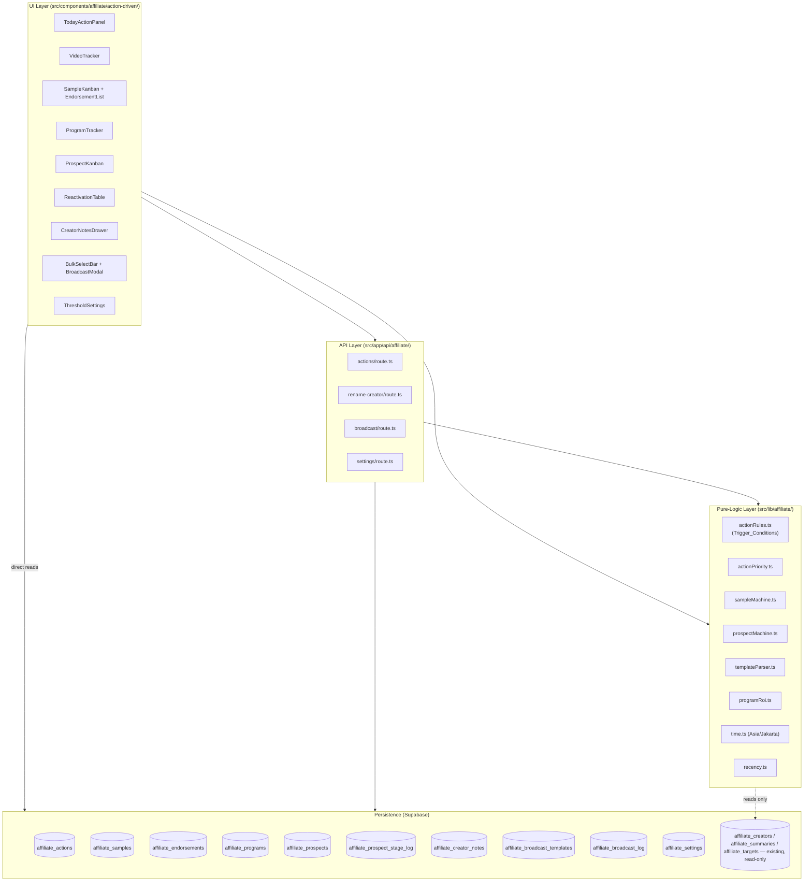
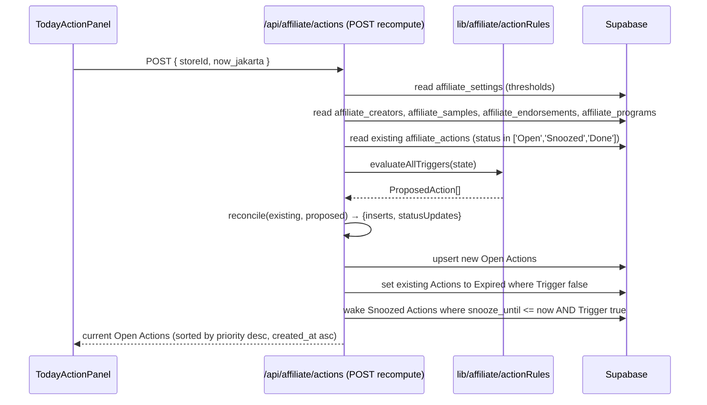
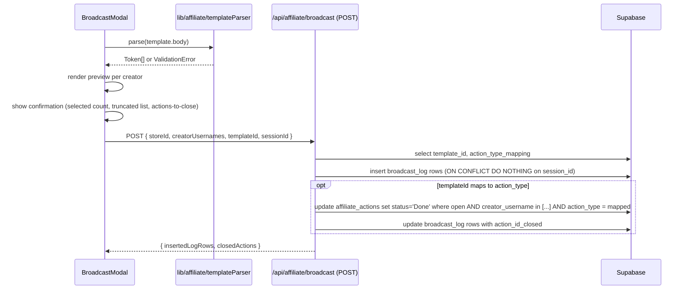

# Design Document

## Overview

The Affiliate Action-Driven feature layers eight coordinated sub-systems on top of the existing `AffiliateScreen` analytics module, transforming it from a "what IS" dashboard into a daily "what to DO next" operating system for the single admin managing ~2,000 TikTok Shop creators.

The design is organised around three layers:

1. **Pure-logic layer** (`src/lib/affiliate/`): deterministic, side-effect-free functions that implement action-rule evaluation, the sample/prospect state machines, template parsing/serialisation, program-ROI arithmetic, and the priority formula. This layer is the primary target for property-based testing.
2. **Persistence layer** (`src/lib/db.ts` extensions + Supabase tables): all nine new tables, scoped by `store_id`, mutated only via typed async functions.
3. **UI layer** (`src/components/affiliate/action-driven/`): new panels, modals, and Kanban boards rendered inside `AffiliateScreen` as additional tabs/drill-downs. All existing views (Dashboard, Kreator, Perbandingan, KPI cards, Pareto, segmentation, target-vs-achievement) remain untouched.

The feature is additive: zero existing behaviour is removed or regressed. New capabilities activate only when Supabase is configured; otherwise, each new panel renders a "Requires Supabase" empty state while legacy read-only views continue to function.

### Key Design Decisions

- **Actions are materialised, not pure-derived.** Rather than re-deriving Open Actions from creator state on every render, Trigger_Conditions are evaluated on dashboard mount / manual refresh and their results are persisted in `affiliate_actions`. This preserves `snooze_until` state, supports the Mark_Done idempotence property, and enables the "Done → later re-opens as new Action" lifecycle in Requirement 1.19.
- **Video_Target lives in the existing `affiliate_targets` table** (Requirement 2.14). No parallel video-target store is introduced.
- **Single-admin assumption** is honoured: `created_by` is hard-coded to the literal string `"admin"` (Requirement 7.6) so no auth plumbing is required.
- **All dates evaluated in Asia/Jakarta (UTC+7).** A single helper `jakartaNow()` / `jakartaDate()` in `src/lib/affiliate/time.ts` is the only place timezone conversion happens.
- **Rename_Creator is a Supabase RPC**, not a multi-statement client transaction, to satisfy the atomicity requirement (7.9) under Supabase's client library (no client-side transactions).
- **Bulk action idempotence within a session** is enforced by a client-side `session_id` tracked in `sessionStorage`, plus a unique index on `(store_id, creator_username, template_id, session_id)` in `affiliate_broadcast_log`.

### Research Notes

- **Next.js 16 route handlers** (`node_modules/next/dist/docs/01-app/01-getting-started/15-route-handlers.md`): the project already uses the `app/api/**/route.ts` pattern with `NextRequest`/`NextResponse`. New endpoints (`/api/affiliate/actions`, `/api/affiliate/rename-creator`, `/api/affiliate/broadcast`) follow this pattern. Route Handlers are not cached by default, so `GET` endpoints that read live data need no additional configuration.
- **Supabase JS v2** (already in `package.json@2.103.3`): supports `.rpc()` for custom Postgres functions (used for `rename_creator_rpc`) and `upsert` with `onConflict` (used for idempotent bulk operations).
- **Existing persistence patterns** (`src/lib/db.ts`): all new table accessors follow the same `requireSupabase()` → typed row converter → typed domain converter pattern already used for `affiliate_summaries`, `affiliate_creators`, and `stores`.
- **Zustand store manager** (`src/store/useStoreManager.ts`): the active `store_id` is available via `useStoreManager.getActiveStore()?.id`. Switching stores already clears GMV/Video/Affiliate caches; new caches (Actions, Samples, Endorsements, Programs, Prospects, Notes, Templates, Log) are added to the same invalidation path in Requirement 9.6.
- **Recharts** (already in `package.json@3.8.1`) provides the Progress_Ring (`RadialBarChart`), 30-day trend (`LineChart`), and funnel (`BarChart`) visuals without adding new dependencies.

---

## Architecture

### High-Level Shape



### The Eight Sub-Systems

Each sub-system is a self-contained slice mapping 1:1 to a requirement number.

| # | Sub-system | Requirement | Primary table | UI component |
|---|------------|-------------|---------------|---------------|
| A | Today's Action List | R1 | `affiliate_actions` | `TodayActionPanel` |
| B | Video Production Tracker | R2 | reuses `affiliate_targets` | `VideoTracker` |
| C | Sample & Endorse Tracker | R3 | `affiliate_samples`, `affiliate_endorsements` | `SampleKanban`, `EndorsementList` |
| D | Program Tracker | R4 | `affiliate_programs` | `ProgramTracker` |
| E | New Creator Pipeline | R5 | `affiliate_prospects`, `affiliate_prospect_stage_log` | `ProspectKanban` |
| F | Re-activation Candidates | R6 | derived (reads `affiliate_creators`) | `ReactivationTable` |
| G | Quick Notes per Creator | R7 | `affiliate_creator_notes` | `CreatorNotesDrawer` |
| H | Bulk Actions & Broadcast | R8 | `affiliate_broadcast_templates`, `affiliate_broadcast_log` | `BulkSelectBar`, `BroadcastModal` |

Cross-system integration points:

- **H closes A.** Marking a broadcast sent from sub-system H closes matching Open Actions in sub-system A via the fixed Template→Action_Type mapping (R8.11, R8.13).
- **C feeds A.** Overdue Samples (C) generate Follow_Up_Sample Actions (A.3). Active Endorsements/Programs nearing deadline (C, D) generate Chase_Delivery Actions (A.5).
- **E upgrades to C/A.** A Prospect in First_Video stage gets a suggestion when it appears in `affiliate_creators` with `affiliate_shoppable_videos ≥ 1` (R5.9).
- **G is write-only for admin, read-only for everyone else.** Notes are append-only (R7.8); the only mutation path is the `rename_creator_rpc` Supabase function (R7.9).
- **F reads A's threshold.** Reactivation_Min_Max_GMV and Dormant_Threshold_Days both live in `affiliate_settings` (R10).

### Data Flow: Action Recompute

The recompute pipeline runs on `AffiliateScreen` mount and on manual "Refresh Actions" click (R1.15).



`reconcile` is a pure function (target of property-based tests) with the signature:

```ts
function reconcile(
  existing: ExistingAction[],
  proposed: ProposedAction[],
  now: JakartaDateTime,
): { inserts: NewAction[]; toExpire: string[]; toOpen: string[] }
```

Reconciliation rules (from R1):
- For each `proposed`, look up existing Actions with the same `(creator_username, action_type, trigger_key)` where `trigger_key` is the per-Action_Type uniqueness key (e.g. `sample_id` for Follow_Up_Sample, `YYYY-MM` for Recover_Star, `program_id`/`endorsement_id` for Chase_Delivery).
- If no Open/Snoozed/recent-Done exists for the key → insert new Open Action.
- If an Open/Snoozed exists and trigger still holds → leave it.
- If an Open/Snoozed exists and trigger no longer holds → set to Expired.
- If a Done exists and trigger evaluates back to true after having been false → insert a **new** Action with a distinct id (R1.19).
- If a Snoozed has `snooze_until <= now` and trigger still holds → reopen (R1.13).

### Data Flow: Bulk Broadcast with Action Closure



Idempotence is enforced at the DB level by a **unique index** on `affiliate_broadcast_log (store_id, creator_username, template_id, session_id)` combined with `ON CONFLICT DO NOTHING`. A client-generated `session_id` per admin visit ensures that re-clicking "Mark broadcast sent" within the same session is a no-op but a later visit is a distinct broadcast (R8.17).

---

## Components and Interfaces

### Directory Layout

```
src/
  app/api/affiliate/
    actions/route.ts           # POST recompute, PATCH mark done/snooze
    rename-creator/route.ts    # POST: calls rename_creator_rpc
    broadcast/route.ts         # POST mark broadcast sent
    settings/route.ts          # GET/PUT affiliate_settings
  components/affiliate/action-driven/
    TodayActionPanel.tsx
    ActionRow.tsx
    VideoTracker.tsx
    SampleKanban.tsx
    SampleCard.tsx
    SampleForm.tsx
    EndorsementList.tsx
    EndorsementForm.tsx
    ProgramTracker.tsx
    ProgramForm.tsx
    ProspectKanban.tsx
    ProspectCard.tsx
    ProspectImportModal.tsx
    ReactivationTable.tsx
    CreatorNotesDrawer.tsx
    NoteEntry.tsx
    BulkSelectBar.tsx
    BroadcastModal.tsx
    TemplateEditor.tsx
    ThresholdSettings.tsx
  lib/affiliate/
    time.ts                    # jakartaNow, jakartaDate, monthsBetween
    actionRules.ts             # Trigger_Conditions (pure)
    actionPriority.ts          # Action_Priority formula (pure)
    sampleMachine.ts           # allowed transitions (pure)
    prospectMachine.ts         # stage ordering (pure)
    templateParser.ts          # parse/serialize (pure, round-trip)
    programRoi.ts              # program_gmv, program_cost, program_roi (pure)
    recency.ts                 # recency_weight (pure)
    variableSubstitution.ts    # build Variable_Substitution_Map per creator
  lib/db-affiliate-action.ts   # all new table accessors (mirrors pattern of db.ts)
```

### Core Interfaces

```ts
// src/lib/affiliate/actionRules.ts

export type ActionType =
  | 'Follow_Up_Sample'
  | 'Recover_Star'
  | 'Chase_Delivery'
  | 'Reward_Momentum'
  | 'Investigate_Refunds'
  | 'Reactivation_Candidate'
  | 'Follow_Up_Broadcast';

export type ActionStatus = 'Open' | 'Done' | 'Snoozed' | 'Expired';

export interface Thresholds {
  dormantThresholdDays: number;        // 7..365
  sampleFollowUpDays: number;          // 1..30
  chaseDeliveryWindowDays: number;     // 1..30
  momentumMultiplier: number;          // 1.1..5.0
  recoverStarTopN: number;             // 5..100
  reactivationMinMaxGmv: number;       // 100_000..100_000_000
  defaultCommissionRate: number;       // 0..1
}

export interface CreatorState {
  username: string;
  // Per-month records from affiliate_creators joined across periods:
  monthlyGmv: Record<string, number>;        // 'YYYY-MM' → GMV
  monthlyVideos: Record<string, number>;
  monthlyRefundedGmv: Record<string, number>;
  maxHistoricalMonthlyGmv: number;
  lastActivityDate: string | null;           // YYYY-MM-DD Asia/Jakarta
}

export interface TriggerContext {
  now: JakartaDateTime;
  thresholds: Thresholds;
  creators: CreatorState[];
  samples: SampleRecord[];
  endorsements: EndorsementRecord[];
  programs: ProgramRecord[];
}

export interface ProposedAction {
  creatorUsername: string;
  actionType: ActionType;
  triggerKey: string;          // stable key for per-pair uniqueness
  whyNow: string;
  dueAt: string;
}

// Pure: same inputs → same outputs. Target of property tests.
export function evaluateAllTriggers(ctx: TriggerContext): ProposedAction[];

// Per-type trigger functions (all pure):
export function triggerFollowUpSample(ctx: TriggerContext): ProposedAction[];
export function triggerRecoverStar(ctx: TriggerContext): ProposedAction[];
export function triggerChaseDelivery(ctx: TriggerContext): ProposedAction[];
export function triggerRewardMomentum(ctx: TriggerContext): ProposedAction[];
export function triggerInvestigateRefunds(ctx: TriggerContext): ProposedAction[];
export function triggerReactivationCandidate(ctx: TriggerContext): ProposedAction[];
```

```ts
// src/lib/affiliate/actionPriority.ts

export const ACTION_TYPE_WEIGHT: Record<ActionType, number> = {
  Chase_Delivery: 100,
  Investigate_Refunds: 90,
  Follow_Up_Sample: 70,
  Recover_Star: 60,
  Reactivation_Candidate: 40,
  Reward_Momentum: 30,
  Follow_Up_Broadcast: 20,
};

/** Piecewise on maxHistoricalMonthlyGmv in IDR (R1.16). */
export function gmvScale(maxMonthlyGmv: number): 1.0 | 1.25 | 1.5 | 2.0 {
  if (maxMonthlyGmv >= 100_000_000) return 2.0;
  if (maxMonthlyGmv >= 10_000_000) return 1.5;
  if (maxMonthlyGmv >= 1_000_000) return 1.25;
  return 1.0;
}

export function actionPriority(type: ActionType, maxMonthlyGmv: number): number {
  return ACTION_TYPE_WEIGHT[type] * gmvScale(maxMonthlyGmv);
}
```

```ts
// src/lib/affiliate/sampleMachine.ts

export type SampleStatus = 'Sent' | 'Received' | 'Posted' | 'Sold' | 'Failed';

export const ALLOWED_SAMPLE_TRANSITIONS: ReadonlyArray<[SampleStatus, SampleStatus]> = [
  ['Sent', 'Received'],
  ['Sent', 'Posted'],
  ['Sent', 'Failed'],
  ['Received', 'Posted'],
  ['Received', 'Failed'],
  ['Posted', 'Sold'],
  ['Posted', 'Failed'],
  ['Sold', 'Failed'],
];

export function isAllowedTransition(from: SampleStatus, to: SampleStatus): boolean;

/** Apply a sequence of transitions; returns the final status or throws on first invalid transition. */
export function applyTransitions(initial: SampleStatus, seq: SampleStatus[]): SampleStatus;
```

```ts
// src/lib/affiliate/prospectMachine.ts

export type ProspectStage =
  | 'Prospect' | 'Contacted' | 'Replied' | 'Sample_Sent' | 'First_Video' | 'Active';

export const STAGE_ORDER: ProspectStage[] = [
  'Prospect', 'Contacted', 'Replied', 'Sample_Sent', 'First_Video', 'Active',
];

export function isForwardTransition(from: ProspectStage, to: ProspectStage): boolean;
export function isBackwardTransition(from: ProspectStage, to: ProspectStage): boolean;
```

```ts
// src/lib/affiliate/templateParser.ts

export type Token =
  | { kind: 'literal'; text: string }
  | { kind: 'variable'; name: string };

export const PERMITTED_VARIABLES = [
  'creator_name', 'last_gmv', 'sku_name', 'last_video_date', 'custom_note',
] as const;
export type PermittedVariable = typeof PERMITTED_VARIABLES[number];

/** Parses a template body into a sequence of literal/variable tokens.
 * Delimiters are `{{` and `}}`; variable names are trimmed of ASCII whitespace inside. */
export function parseTemplate(body: string): Token[];

/** Serializes tokens back to a body. serialize(parse(b)) = b for valid b. */
export function serializeTemplate(tokens: Token[]): string;

/** Returns the list of referenced variable names (trimmed) in order of appearance. */
export function extractVariableNames(body: string): string[];

/** Throws ValidationError if any referenced variable name is not in PERMITTED_VARIABLES. */
export function validateTemplate(body: string): void;

/** Renders a template by substituting variables. Missing/null/undefined → empty string. */
export function renderTemplate(
  body: string,
  substitutions: Partial<Record<PermittedVariable, string>>,
): string;
```

```ts
// src/lib/affiliate/programRoi.ts

export interface MonthlyGmvSeries {
  /** 'YYYY-MM' → gmv for that calendar month */
  [month: string]: number;
}

/** Pro-rated program GMV per R4.5, R14. Pure function. */
export function programGmv(
  monthlyGmv: MonthlyGmvSeries,
  startDate: string,  // YYYY-MM-DD Asia/Jakarta
  endDate: string,    // YYYY-MM-DD Asia/Jakarta
): number;

/** program_cost = fee + max(0, (rate − default) × gmv). Pure. */
export function programCost(
  feeAmount: number,
  commissionRate: number | null,
  defaultCommissionRate: number,
  programGmvValue: number,
): number;

/** Returns null when cost is 0 (UI shows "N/A"). */
export function programRoi(gmv: number, cost: number): number | null;
```

```ts
// src/lib/affiliate/recency.ts

/** recency_weight(m) = max(0.2, 1.0 − 0.1·m). Monotonically non-increasing. */
export function recencyWeight(monthsSinceLastActivity: number): number;

/** months_since = floor((today - last) / 30 days). */
export function monthsSinceLastActivity(
  today: string,           // YYYY-MM-DD
  lastActivity: string,    // YYYY-MM-DD
): number;

export function recoveryPotential(maxMonthlyGmv: number, months: number): number;
```

```ts
// src/lib/affiliate/time.ts

export type JakartaDate = string;       // 'YYYY-MM-DD'
export type JakartaDateTime = string;   // ISO-8601 with +07:00 offset

export function jakartaNow(): JakartaDateTime;
export function jakartaDate(d?: Date): JakartaDate;
export function jakartaMonth(d?: Date): string;  // 'YYYY-MM'
export function daysBetween(a: JakartaDate, b: JakartaDate): number;
export function addDays(d: JakartaDate, n: number): JakartaDate;
export function daysInMonth(month: string): number;  // 'YYYY-MM' → 28..31
```

### UI Component Contract

All new components share a common contract:

- **Stateless with respect to cross-session data.** Any business record is sourced from Supabase; only ephemeral UI state (selected filters, modal open/closed, draft form values) lives in React state.
- **`store_id` is read from `useStoreManager.getActiveStore()?.id`.** All queries filter by it. When the active store changes, each component's `useEffect` re-fetches (R9.6).
- **Supabase-not-configured state is rendered inline.** Each component checks `isSupabaseConfigured` from `src/lib/supabase.ts` and renders a "Requires Supabase" block with write controls disabled (R9.8).
- **Optimistic-only where safe** (toggling snooze, marking done). Destructive writes (state transitions, bulk broadcast) wait for server confirmation.

Example signature:

```ts
// src/components/affiliate/action-driven/TodayActionPanel.tsx
export interface TodayActionPanelProps {
  storeId: string;
  onActionClick?: (action: Action) => void;
}
export default function TodayActionPanel(props: TodayActionPanelProps): JSX.Element;
```

### AffiliateScreen Integration

`AffiliateScreen.tsx` gains three new tab values (added without disturbing existing `ViewMode`):

```ts
type ViewMode =
  | 'dashboard' | 'creators' | 'comparison'  // existing
  | 'actions' | 'production' | 'pipeline';   // new
```

- `actions` hosts `TodayActionPanel`, `SampleKanban`, `EndorsementList`, `ProgramTracker`, `ReactivationTable`.
- `production` hosts `VideoTracker` and a drill-down from the existing KPI card.
- `pipeline` hosts `ProspectKanban` and `ProspectImportModal`.

The existing Dashboard/Kreator/Perbandingan views get non-intrusive additions:
- A note icon + count badge (R7.3) next to each creator in the Kreator list.
- A row-level checkbox (R8.1) and "select all filtered" header checkbox.
- A pinned `BulkSelectBar` that appears when ≥1 creator is selected.

---

## Data Models

### TypeScript Domain Types

Added to `src/lib/types.ts` as a new "Affiliate Action-Driven" section. No existing types are modified.

```ts
// ─── Affiliate Action-Driven ─────────────────────────────

export type ActionType =
  | 'Follow_Up_Sample' | 'Recover_Star' | 'Chase_Delivery'
  | 'Reward_Momentum' | 'Investigate_Refunds'
  | 'Reactivation_Candidate' | 'Follow_Up_Broadcast';

export type ActionStatus = 'Open' | 'Done' | 'Snoozed' | 'Expired';

export interface Action {
  id: string;                    // uuid
  storeId: string;
  creatorUsername: string;
  actionType: ActionType;
  triggerKey: string;            // e.g. sample_id, 'YYYY-MM', program_id
  status: ActionStatus;
  priority: number;              // cached at insert/update; recomputed on threshold change
  whyNow: string;                // human-readable "why now" text
  createdAt: string;             // ISO-8601 +07:00
  dueAt: string | null;
  snoozeUntil: string | null;
  completedAt: string | null;    // set when status transitions to Done
}

export type SampleStatus = 'Sent' | 'Received' | 'Posted' | 'Sold' | 'Failed';

export interface Sample {
  id: string;
  storeId: string;
  creatorUsername: string;       // may be a Prospect (no matching creator row)
  sku: string;
  dateSent: string;              // YYYY-MM-DD
  expectedPostDate: string;
  status: SampleStatus;
  cost: number | null;
  notes: string | null;
  isProspect: boolean;           // computed at save time: no match in affiliate_creators
  createdAt: string;
  updatedAt: string;
}

export type EndorsementStatus = 'Active' | 'Completed' | 'Cancelled' | 'Breached';

export interface Endorsement {
  id: string;
  storeId: string;
  creatorUsername: string;
  feeAmount: number;
  committedVideos: number;
  committedPosts: number;
  periodStart: string;
  periodEnd: string;
  status: EndorsementStatus;
  notes: string | null;
  isProspect: boolean;
  createdAt: string;
}

export type ProgramType = 'targeted' | 'endorse' | 'custom_commission';
export type ProgramStatus = 'Active' | 'Completed' | 'Cancelled' | 'Breached';

export interface Program {
  id: string;
  storeId: string;
  creatorUsername: string;
  programType: ProgramType;
  startDate: string;
  endDate: string;
  status: ProgramStatus;
  commissionRate: number | null;
  targetGmv: number | null;
  targetVideos: number | null;
  feeAmount: number | null;
  notes: string | null;
  createdAt: string;
  // Derived fields (not persisted; computed on read):
  programGmv?: number;
  programCost?: number;
  programRoi?: number | null;
  actualVideos?: number;
}

export type ProspectStage =
  | 'Prospect' | 'Contacted' | 'Replied'
  | 'Sample_Sent' | 'First_Video' | 'Active';

export interface Prospect {
  id: string;
  storeId: string;
  creatorUsername: string;
  source: string;
  stage: ProspectStage;
  notes: string | null;
  addedDate: string;
  linkedCreatorUsername: string | null;
  createdAt: string;
}

export type NoteType = 'chat' | 'issue' | 'commission_request' | 'feedback' | 'other';

export interface CreatorNote {
  id: string;
  storeId: string;
  creatorUsername: string;
  noteText: string;
  noteType: NoteType;
  createdAt: string;
  createdBy: string;    // always 'admin' in v1
}

export interface BroadcastTemplate {
  id: string;
  storeId: string;
  name: string;
  body: string;                       // 1..4000 chars
  actionTypeMapping: ActionType | null; // fixed for seeded 4; null for custom
  isSystemSeeded: boolean;
  createdAt: string;
  updatedAt: string;
}

export interface BroadcastLog {
  id: string;
  storeId: string;
  sessionId: string;
  creatorUsername: string;
  templateId: string;
  sentAt: string;
  actionIdClosed: string | null;
}

export interface AffiliateSettings {
  storeId: string;
  dormantThresholdDays: number;
  sampleFollowUpDays: number;
  chaseDeliveryWindowDays: number;
  momentumMultiplier: number;
  recoverStarTopN: number;
  reactivationMinMaxGmv: number;
  defaultCommissionRate: number;
  updatedAt: string;
}
```

### Supabase Schema

All tables are created in a single migration file `supabase/migrations/YYYYMMDD_affiliate_action_driven.sql`.

```sql
-- 1. Settings (one row per store)
CREATE TABLE affiliate_settings (
  store_id uuid PRIMARY KEY REFERENCES stores(id) ON DELETE CASCADE,
  dormant_threshold_days int NOT NULL DEFAULT 45 CHECK (dormant_threshold_days BETWEEN 7 AND 365),
  sample_follow_up_days int NOT NULL DEFAULT 3 CHECK (sample_follow_up_days BETWEEN 1 AND 30),
  chase_delivery_window_days int NOT NULL DEFAULT 7 CHECK (chase_delivery_window_days BETWEEN 1 AND 30),
  momentum_multiplier numeric(3,1) NOT NULL DEFAULT 1.5 CHECK (momentum_multiplier BETWEEN 1.1 AND 5.0),
  recover_star_top_n int NOT NULL DEFAULT 20 CHECK (recover_star_top_n BETWEEN 5 AND 100),
  reactivation_min_max_gmv bigint NOT NULL DEFAULT 500000 CHECK (reactivation_min_max_gmv BETWEEN 100000 AND 100000000),
  default_commission_rate numeric(4,3) NOT NULL DEFAULT 0.080 CHECK (default_commission_rate BETWEEN 0.0 AND 1.0),
  updated_at timestamptz NOT NULL DEFAULT now()
);

-- 2. Samples
CREATE TABLE affiliate_samples (
  id uuid PRIMARY KEY DEFAULT gen_random_uuid(),
  store_id uuid NOT NULL REFERENCES stores(id) ON DELETE CASCADE,
  creator_username text NOT NULL,
  sku text NOT NULL CHECK (char_length(sku) BETWEEN 1 AND 100),
  date_sent date NOT NULL,
  expected_post_date date NOT NULL,
  status text NOT NULL CHECK (status IN ('Sent','Received','Posted','Sold','Failed')),
  cost bigint CHECK (cost IS NULL OR (cost >= 0 AND cost <= 100000000)),
  notes text CHECK (notes IS NULL OR char_length(notes) <= 1000),
  is_prospect boolean NOT NULL DEFAULT false,
  created_at timestamptz NOT NULL DEFAULT now(),
  updated_at timestamptz NOT NULL DEFAULT now(),
  CHECK (expected_post_date >= date_sent)
);
CREATE INDEX idx_samples_store_status ON affiliate_samples(store_id, status);
CREATE INDEX idx_samples_store_creator ON affiliate_samples(store_id, creator_username);

-- 3. Endorsements
CREATE TABLE affiliate_endorsements (
  id uuid PRIMARY KEY DEFAULT gen_random_uuid(),
  store_id uuid NOT NULL REFERENCES stores(id) ON DELETE CASCADE,
  creator_username text NOT NULL,
  fee_amount bigint NOT NULL CHECK (fee_amount >= 0 AND fee_amount <= 1000000000),
  committed_videos int NOT NULL CHECK (committed_videos >= 0 AND committed_videos <= 10000),
  committed_posts int NOT NULL CHECK (committed_posts >= 0 AND committed_posts <= 10000),
  period_start date NOT NULL,
  period_end date NOT NULL,
  status text NOT NULL CHECK (status IN ('Active','Completed','Cancelled','Breached')),
  notes text CHECK (notes IS NULL OR char_length(notes) <= 1000),
  is_prospect boolean NOT NULL DEFAULT false,
  created_at timestamptz NOT NULL DEFAULT now(),
  CHECK (period_end >= period_start)
);
CREATE INDEX idx_endorsements_store_creator ON affiliate_endorsements(store_id, creator_username);
CREATE INDEX idx_endorsements_store_status ON affiliate_endorsements(store_id, status);

-- 4. Programs
CREATE TABLE affiliate_programs (
  id uuid PRIMARY KEY DEFAULT gen_random_uuid(),
  store_id uuid NOT NULL REFERENCES stores(id) ON DELETE CASCADE,
  creator_username text NOT NULL,
  program_type text NOT NULL CHECK (program_type IN ('targeted','endorse','custom_commission')),
  start_date date NOT NULL,
  end_date date NOT NULL,
  status text NOT NULL CHECK (status IN ('Active','Completed','Cancelled','Breached')),
  commission_rate numeric(4,3) CHECK (commission_rate IS NULL OR (commission_rate >= 0.0 AND commission_rate <= 1.0)),
  target_gmv bigint CHECK (target_gmv IS NULL OR (target_gmv >= 0 AND target_gmv <= 10000000000)),
  target_videos int CHECK (target_videos IS NULL OR (target_videos >= 0 AND target_videos <= 100000)),
  fee_amount bigint CHECK (fee_amount IS NULL OR (fee_amount >= 0 AND fee_amount <= 10000000000)),
  notes text CHECK (notes IS NULL OR char_length(notes) <= 1000),
  created_at timestamptz NOT NULL DEFAULT now(),
  CHECK (end_date >= start_date)
);
-- Enforce "one active per (creator, type) with overlapping window" via partial unique exclusion:
CREATE INDEX idx_programs_store_creator_type_active ON affiliate_programs(store_id, creator_username, program_type)
  WHERE status = 'Active';

-- 5. Prospects
CREATE TABLE affiliate_prospects (
  id uuid PRIMARY KEY DEFAULT gen_random_uuid(),
  store_id uuid NOT NULL REFERENCES stores(id) ON DELETE CASCADE,
  creator_username text NOT NULL CHECK (char_length(creator_username) BETWEEN 1 AND 100),
  source text NOT NULL,
  stage text NOT NULL CHECK (stage IN ('Prospect','Contacted','Replied','Sample_Sent','First_Video','Active')),
  notes text CHECK (notes IS NULL OR char_length(notes) <= 10000),
  added_date date NOT NULL DEFAULT (now() AT TIME ZONE 'Asia/Jakarta')::date,
  linked_creator_username text,
  created_at timestamptz NOT NULL DEFAULT now(),
  UNIQUE (store_id, creator_username)
);

-- 6. Prospect stage log (audit trail, R5.11)
CREATE TABLE affiliate_prospect_stage_log (
  id uuid PRIMARY KEY DEFAULT gen_random_uuid(),
  store_id uuid NOT NULL REFERENCES stores(id) ON DELETE CASCADE,
  prospect_id uuid NOT NULL REFERENCES affiliate_prospects(id) ON DELETE CASCADE,
  from_stage text,
  to_stage text NOT NULL,
  reason text,
  changed_at timestamptz NOT NULL DEFAULT now()
);
CREATE INDEX idx_prospect_stage_log_prospect ON affiliate_prospect_stage_log(prospect_id, changed_at);

-- 7. Creator notes (append-only)
CREATE TABLE affiliate_creator_notes (
  id uuid PRIMARY KEY DEFAULT gen_random_uuid(),
  store_id uuid NOT NULL REFERENCES stores(id) ON DELETE CASCADE,
  creator_username text NOT NULL,
  note_text text NOT NULL CHECK (char_length(note_text) BETWEEN 1 AND 2000),
  note_type text NOT NULL CHECK (note_type IN ('chat','issue','commission_request','feedback','other')),
  created_by text NOT NULL DEFAULT 'admin',
  created_at timestamptz NOT NULL DEFAULT now()
);
CREATE INDEX idx_notes_store_creator ON affiliate_creator_notes(store_id, creator_username, created_at DESC);
-- Notes are append-only: no UPDATE or DELETE policies are granted to anon/authenticated roles.
-- The only mutation path is the rename_creator_rpc function.

-- 8. Broadcast templates
CREATE TABLE affiliate_broadcast_templates (
  id uuid PRIMARY KEY DEFAULT gen_random_uuid(),
  store_id uuid NOT NULL REFERENCES stores(id) ON DELETE CASCADE,
  name text NOT NULL,
  body text NOT NULL CHECK (char_length(body) BETWEEN 1 AND 4000),
  action_type_mapping text CHECK (action_type_mapping IS NULL OR action_type_mapping IN (
    'Follow_Up_Sample','Recover_Star','Chase_Delivery','Reward_Momentum',
    'Investigate_Refunds','Reactivation_Candidate','Follow_Up_Broadcast'
  )),
  is_system_seeded boolean NOT NULL DEFAULT false,
  created_at timestamptz NOT NULL DEFAULT now(),
  updated_at timestamptz NOT NULL DEFAULT now(),
  UNIQUE (store_id, name)
);

-- 9. Broadcast log (idempotence via unique index on session)
CREATE TABLE affiliate_broadcast_log (
  id uuid PRIMARY KEY DEFAULT gen_random_uuid(),
  store_id uuid NOT NULL REFERENCES stores(id) ON DELETE CASCADE,
  session_id text NOT NULL,
  creator_username text NOT NULL,
  template_id uuid NOT NULL REFERENCES affiliate_broadcast_templates(id) ON DELETE RESTRICT,
  sent_at timestamptz NOT NULL DEFAULT now(),
  action_id_closed uuid
);
CREATE UNIQUE INDEX uq_broadcast_log_session
  ON affiliate_broadcast_log(store_id, session_id, creator_username, template_id);

-- 10. Actions
CREATE TABLE affiliate_actions (
  id uuid PRIMARY KEY DEFAULT gen_random_uuid(),
  store_id uuid NOT NULL REFERENCES stores(id) ON DELETE CASCADE,
  creator_username text NOT NULL,
  action_type text NOT NULL CHECK (action_type IN (
    'Follow_Up_Sample','Recover_Star','Chase_Delivery','Reward_Momentum',
    'Investigate_Refunds','Reactivation_Candidate','Follow_Up_Broadcast'
  )),
  trigger_key text NOT NULL,
  status text NOT NULL CHECK (status IN ('Open','Done','Snoozed','Expired')),
  priority numeric NOT NULL,
  why_now text NOT NULL,
  created_at timestamptz NOT NULL DEFAULT now(),
  due_at timestamptz,
  snooze_until timestamptz,
  completed_at timestamptz
);
CREATE INDEX idx_actions_store_status_priority
  ON affiliate_actions(store_id, status, priority DESC, created_at ASC)
  WHERE status IN ('Open','Snoozed');
CREATE UNIQUE INDEX uq_open_action_per_trigger
  ON affiliate_actions(store_id, creator_username, action_type, trigger_key)
  WHERE status IN ('Open','Snoozed');
```

### Rename_Creator RPC (R7.9)

```sql
CREATE OR REPLACE FUNCTION rename_creator_rpc(
  p_store_id uuid,
  p_old_username text,
  p_new_username text
) RETURNS void
LANGUAGE plpgsql
AS $$
BEGIN
  -- Single transaction: all updates succeed or none do.
  UPDATE affiliate_creator_notes SET creator_username = p_new_username
    WHERE store_id = p_store_id AND creator_username = p_old_username;
  UPDATE affiliate_samples SET creator_username = p_new_username
    WHERE store_id = p_store_id AND creator_username = p_old_username;
  UPDATE affiliate_endorsements SET creator_username = p_new_username
    WHERE store_id = p_store_id AND creator_username = p_old_username;
  UPDATE affiliate_programs SET creator_username = p_new_username
    WHERE store_id = p_store_id AND creator_username = p_old_username;
  UPDATE affiliate_prospects SET creator_username = p_new_username
    WHERE store_id = p_store_id AND creator_username = p_old_username;
  UPDATE affiliate_actions SET creator_username = p_new_username
    WHERE store_id = p_store_id AND creator_username = p_old_username;
  UPDATE affiliate_broadcast_log SET creator_username = p_new_username
    WHERE store_id = p_store_id AND creator_username = p_old_username;
END;
$$;
```

### Seed Data

Four system templates seeded on first settings load per store (R8.3):

| Name | Body | action_type_mapping |
|---|---|---|
| Follow-Up Sample | `Halo @{{creator_name}}, kami cek-in untuk sampel {{sku_name}} yang kami kirim. Apakah sudah diterima?` | `Follow_Up_Sample` |
| Retention Push | `Halo @{{creator_name}}, kami kangen konten kamu! GMV terakhir: {{last_gmv}}. Yuk aktif lagi bulan ini.` | `Reactivation_Candidate` |
| Commission Offer | `Halo @{{creator_name}}, performa kamu lagi naik ({{last_gmv}}). Kami mau tawarkan commission upgrade.` | `Reward_Momentum` |
| Refund Complaint | `Halo @{{creator_name}}, kami notice ada refund-rate tinggi bulan ini. Bisa kita diskusikan?` | `Investigate_Refunds` |

---

